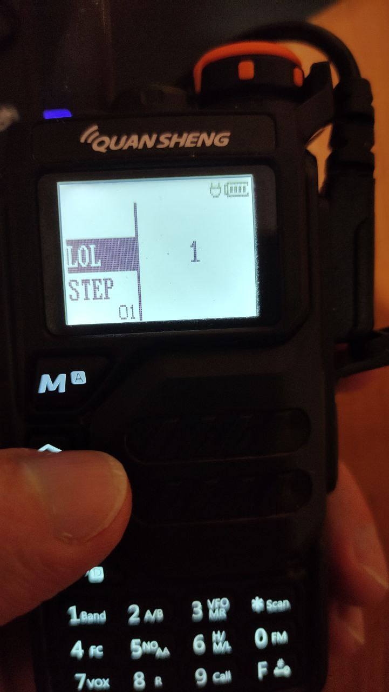

# Quansheng UV-K5 firmware encoder/decoder

WARNING: I am not responsible for the consequences of using. Think before use twice or more. =)

Supports updater [v1.1.7](https://drive.google.com/file/d/1l7NiaImDJCEhKz6BdxD4UxNbs_u4J-cr/view?usp=share_link) (decrypted only) and [1.1.11+](https://drive.google.com/file/d/1hvjFoKGwMibhNqMi6X-rjFYcb6iIzUxe/view?usp=share_link) (encrypted only).

## Usage

### Example modding

Supported versions see inside `addresses` directory.

Values editable by versions inside `mods` directory. Take care about exact values, for ex `50 MHz` is `5_000_000`.

```
./modder.py fw/k5_26_encrypted.bin > fw/k5_26_encrypted_mod18to1300.bin
```

### Example UV-K5 programming tool

Common usage:

```
python3 uvk5.py <port> <command> [args]
```

Specific usage:

```
python3 uvk5.py com3 version
python3 uvk5.py com3 channels
```

### Encdec usage


```
./fw.py <enc|dec> input.bin > output.bin
```

Example decrypt

```
./fw.py dec k5_26_encrypted.bin > k5_26_raw.bin
```

Example encrypt

```
./fw.py enc k5_26_raw.bin > k5_26_encrypted.bin
```

## Links

### Special thanks to

@amnemonic for [Mods kitchen, tools](https://github.com/amnemonic/Quansheng_UV-K5_Firmware/tree/main)

@Tunas1337 for [Modded firmwares](https://github.com/Tunas1337/UV-K5-Modded-Firmwares)

@sq5bpf for [uvk5 reverse engineering](https://github.com/sq5bpf/uvk5-reverse-engineering)

@sq5bpf for [k5prog](https://github.com/sq5bpf/k5prog)

### Discussion

[Telegram Channel - EN](https://t.me/quansheng_uvk5_en)

[Telegram Channel - RU](https://t.me/uv_k5)

[Telegram Channel - ES](https://t.me/QuanShengES)

### Information

[Firmware versions](https://drive.google.com/drive/folders/1GXWjiW0geMiAnVxWpm5rf6OUlXT43ZzB?usp=share_link)

[Windows software](https://drive.google.com/drive/folders/1rpQGXZpt3b9hQrC_2rx-hFjnlO8SdsRb?usp=sharing)

[About Quansheng UV-K5 usage](https://mikhail-yudin.ru/notes/quansheng-uv-k5-opyt-raboty/) (Russian)

## Results


